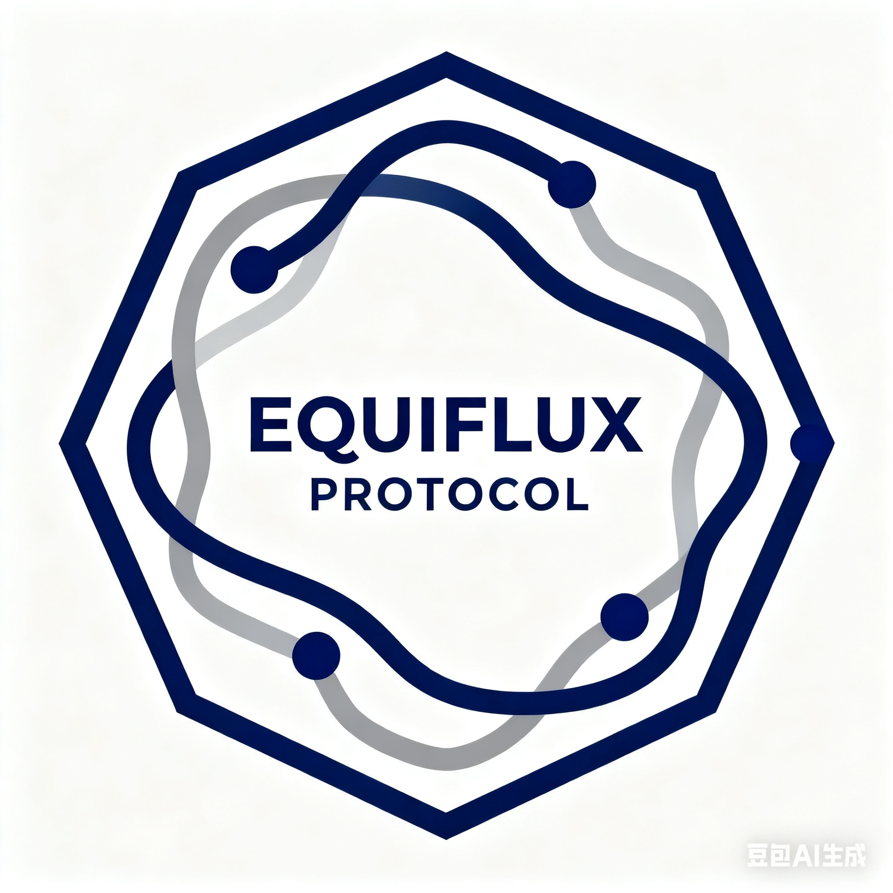

# Equiflux Chain

## 社区自治隐私公链 | Community-Driven Privacy Blockchain

---

**文档版本**：v1.0  
**最后更新**：2025-10-19  
**项目定位**：去中心化社区自治隐私公链  
**核心特性**：三层混合共识：PoS + VRF + 轻量PoW；公平启动（无预挖、无私募）、社区治理  
**治理模式**：完全社区驱动，无预挖，无融资，无中心化控制  
**关键参数**：3秒出块，~8秒确认；≈1800 TPS（基准）

