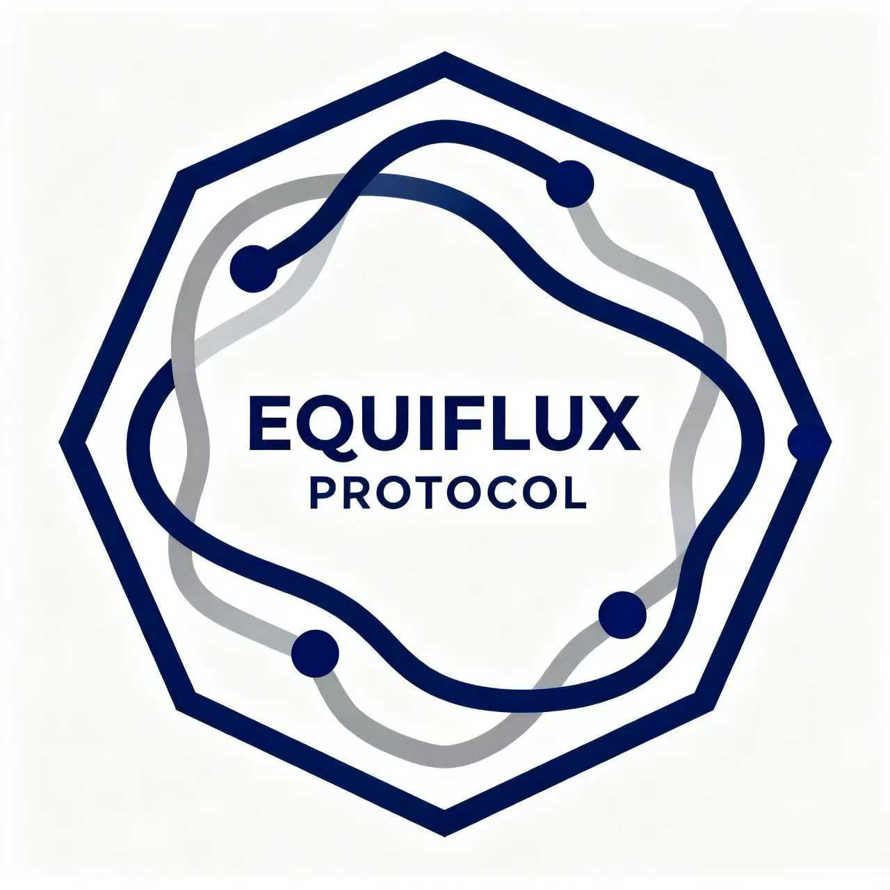

# Equiflux Chain




## 社区自治隐私公链 | Community-Driven Privacy Blockchain

---

**文档版本**：v1.0  
**最后更新**：2025-10-19  
**项目定位**：去中心化社区自治隐私公链  
**核心特性**：三层混合共识 (PoS + VRF + LPoW) + 隐私保护  
**治理模式**：完全社区驱动，无预挖，无融资，无中心化控制

---

**对于开发者**
```bash
# 1. 安装Java和Maven
apt-get install -y openjdk-17-jdk maven

# 2. 克隆仓库
git clone https://github.com/equidflux/node.git
cd node

# 3. 运行测试网节点
mvn clean compile exec:java -Dexec.mainClass="org.equidflux.Main" -Dexec.args="--dev"

# 4. 访问RPC
curl -H "Content-Type: application/json" \
     -d '{"id":1,"jsonrpc":"2.0","method":"chain_getBlock"}' \
     http://localhost:9933
```

**对于节点运营者**
```bash
# 1. 使用Docker快速部署
docker pull equidflux/node:latest
docker run -d \
  --name equidflux-node \
  -p 30333:30333 \
  -p 9933:9933 \
  -p 9615:9615 \
  -v /data/equidflux:/data \
  -e JAVA_OPTS="-Xms4G -Xmx32G" \
  equidflux/node:latest \
  --validator \
  --name "My Node"

# 2. 查看日志
docker logs -f equidflux-node

# 3. 查看Metrics
curl http://localhost:9615/metrics
```

**对于投资者**
```bash
# 1. 下载钱包（Java版本）
wget https://github.com/equidflux/wallet/releases/download/v1.0.0/equidflux-wallet.jar

# 2. 创建钱包
java -jar equidflux-wallet.jar create --output wallet.json

# 3. 获取地址
java -jar equidflux-wallet.jar address --wallet wallet.json

# 4. 质押代币
java -jar equidflux-wallet.jar stake \
  --wallet wallet.json \
  --amount 1000 \
  --validator <validator_address>

# 5. 投票
java -jar equidflux-wallet.jar vote \
  --wallet wallet.json \
  --candidates validator1,validator2,validator3
```
